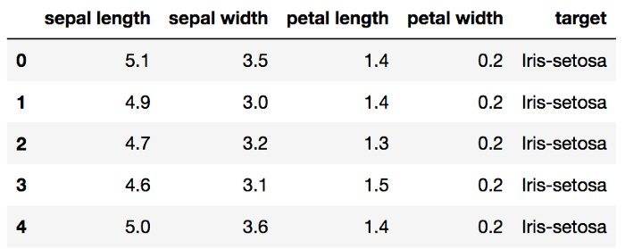
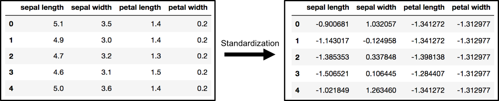
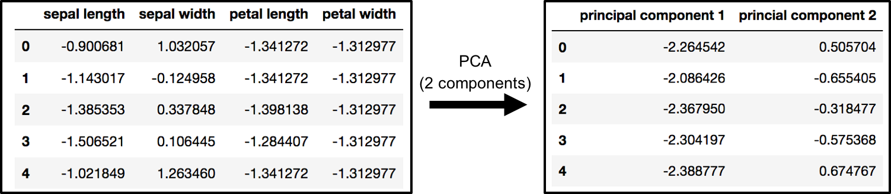
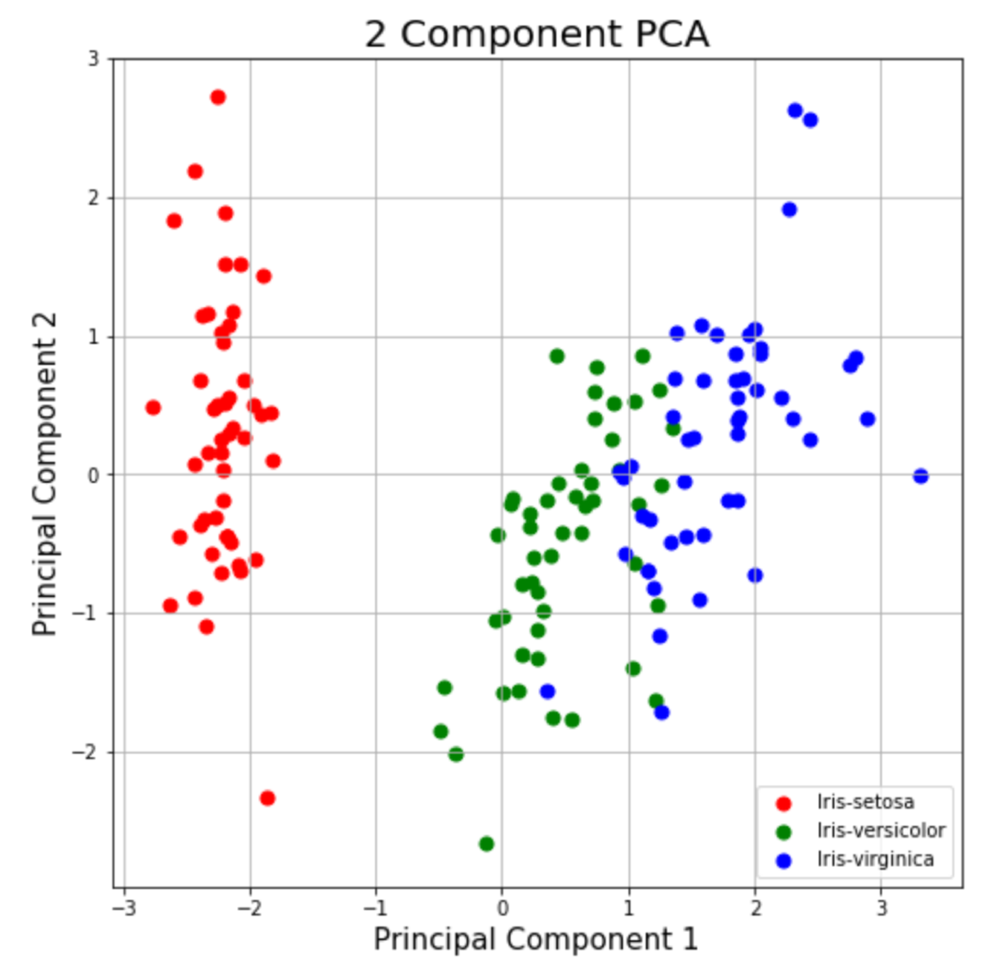

# Spark를 이용한 데이터 전처리 실습


## Spark 내려 받기

- windows terminal or mac terminal을 연다. 
- 소스 코드를 다운 받을 적당한 디렉토리로 이동한다.  
- git 명령어를 이용해 Spark를 내려 받는다. 

```
git clone https://github.com/CUKykkim/data_preprocessing.git
```


## Spark 수행하기

- git을 통해 다운 받은 디렉토리 안으로 들어간다. 

```
cd data_preprocessing
```

- `docker-compose` 명령어를 이용해 스파크 컨테이너를 띄운다. 
  
```
docker-compose up
```

- 컨테이너가 모두 수행이 되면 컨테이너는 다음과 같은 상태가 됨

```
docker ps
```

```
CONTAINER ID   IMAGE                    COMMAND                  CREATED              STATUS          PORTS
                   NAMES
edb3f8d728c9   ykkim77/spark-worker-1   "/bin/bash /worker.sh"   42 seconds ago       Up 36 seconds   0.0.0.0:8081->8081/tcp, :::8081->8081/tcp
                   spark-worker-1
349f58d01f67   ykkim77/spark-master     "/bin/bash /master.sh"   About a minute ago   Up 39 seconds   0.0.0.0:7077->7077/tcp, :::7077->7077/tcp, 6066/tcp, 0.0.0.0:8080->8080/tcp, :::8080->8080/tcp   spark-master
```


- terminal 탭을 하나 더 열어, spark-master 컨테이너로 진입

```
docker exec -it spark-master /bin/bash
```

- spark가 설치된 경로의 디렉토리로 이동

```
cd  ~/../spark/bin/
```


## 결측치 처리 - spark 쉘로 수행하기


- python으로 spark을 연산을 수행할 수 있는 스파크쉘 수행

```
./pyspark
```


```
Welcome to
      ____              __
     / __/__  ___ _____/ /__
    _\ \/ _ \/ _ `/ __/  '_/
   /__ / .__/\_,_/_/ /_/\_\   version 3.1.1
      /_/

Using Python version 3.7.10 (default, Mar  2 2021 09:06:08)
Spark context Web UI available at http://349f58d01f67:4040
Spark context available as 'sc' (master = local[*], app id = local-1632992284633).
SparkSession available as 'spark'.
```


```
df = spark.read.csv('chipotle.csv', header = True, inferSchema = True)  //데이터셋 로드
df.printSchema()     // 데이터셋의 스키마 살펴보기
df.show()             // 데이터셋 보기

print("Total number of :",df.filter(df.choice_description.isNull()).count())   // 결측치 갯수
df1= df.na.drop(how="any")      //결측치 제거
df1.show(truncate=False)       // 결측치 제거된 dataset 확인하기
df2=df1.dropDuplicates(['item_name'])   // item_name 컬럼의 중복 데이터 제거

df2.show()     // 중복 데이터 제거된 데이터셋 확인하기

```

## 결측치 처리 - python application으로 수행하기

- vi 편집기를 열어 missinvalue.py 라는 파이썬 파일을 새로 연다

```
vi missingvalue.py
```


- a를 입력하여 쓰기모드로 변환한후 다음 코드를 작성한다. 
- esc를 눌러 읽기모드로 변환한후 :wq 를 눌러 저장후 빠져나온다.

```
from pyspark.sql import SparkSession
from pyspark.sql.functions import col


spark = SparkSession.builder \      // spark session 열기
    .master("local[*]") \                        // local에 있는 cpu core의 갯수만큼 스레드를 생성해서 병렬처리
    .appName("missingvalue") \                  //app 이름
    .getOrCreate()

df = spark.read.csv('chipotle.csv', header = True, inferSchema = True)


df.printSchema()
df.show()


print("Total number of :",df.filter(df.choice_description.isNull()).count())


df1= df.na.drop(how="any")
df1.show(truncate=False)
df2=df1.dropDuplicates(['item_name'])
df2.show()
```

## iris 데이터로 주성분 분석하기

(출처: https://towardsdatascience.com/ca-using-python-scikit-learn-e653f8989e60)

- iris 데이터셋
```
 caseno	        일련번호
 Sepal Length	꽃받침의 길이 정보
 Sepal Width	꽃받침의 너비 정보
 Petal Length	꽃잎의 길이 정보
 Petal Width	꽃잎의 너비 정보  
 Species	    꽃의 종류 정보  setosa / versicolor / virginica 3종류
```




- iris 데이터 셋의 정규화
iris 데이터셋을 평균이 0, 표준편차 1인 분포를 갖도록 스케일링





- iris 데이셋의 차원 축소
기존 4개의 차원을, 2개의 차원으로 축소




- 차원 축소후, 군집화를 한다면? 




## 결측치 처리 - iris 데이터 전처리 하고, PCA로 차원축소하기


```
from pyspark.sql import SparkSession
from pyspark.ml.feature import StandardScaler,VectorAssembler,PCA

spark = SparkSession.builder.master("local[*]").appName("pca").getOrCreate()

// 파일 읽기
iris = spark.read.csv('iris.csv', header = True, inferSchema = True)

// 피쳐 벡터 어셈블
assembler = VectorAssembler(
    inputCols = ["sepal_length","sepal_width","petal_length","petal_width"], outputCol = 'features')


output = assembler.transform(iris)

output.printSchema()
output.show()

// 평균 0, 표준편차 1로 데이터 정규화
sScaler = StandardScaler(inputCol="features", outputCol="scaled")
standard=sScaler.fit(output).transform(output)
standard.show()

//pca 수행
pca = PCA().setInputCol("scaled").setK(2)
pca.fit(standard).transform(standard).show(20,False)
```


## spark 컨테이너 종료

```
docker-compose down
```

